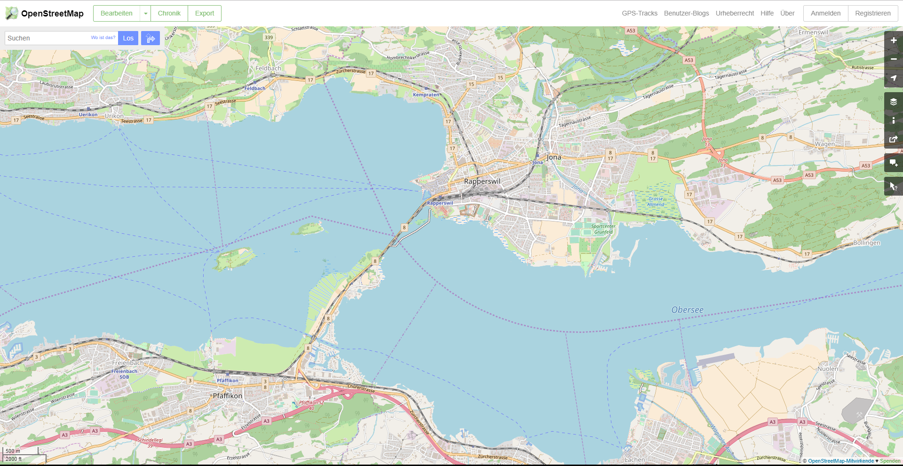

= OSM.org als Karten-Viewer, Blatt 1: openstreetmap.org kennenlernen
OpenSchoolMaps.ch -- Freie Lernmaterialien zu freien Geodaten und Karten.
:lang: de
:figure-caption: Abbildung
//
// HACK: suppress title page.
// See https://github.com/asciidoctor/asciidoctor-pdf/issues/95
ifdef::backend-pdf[:notitle:]

ifdef::backend-pdf[]
[discrete]
= {doctitle}

{author}
endif::[]
// END OF suppress title page HACK

**Ein Arbeitsblatt für Schülerinnen und Schüler**

NOTE: In diesem Arbeitsblatt lernst du das OpenStreetMap-Projekt und seine Hauptwebsite openstreetmap.org kennen. Du lernst, Orte auf der dort verfügbaren Webkarte zu suchen und die Karte zu lesen.

////
Relevante sCHoolmaps-Materialien:
https://www.schoolmaps.ch/wp-content/uploads/2015/11/Arbeit_Swisstopo.pdf

https://www.schoolmaps.ch/2017/06/02/kartenlesen-leicht-gemacht-swisstopo-unterrichtseinheiten-zum-kartenlesen-zyklus-2-von-kiknet/ > https://www.kiknet-swisstopo.org/deutsch/karten-lesen/zyklus-2/ u.A. https://www.kiknet-swisstopo.org/app/download/10636227895/07+geo.admin.ch.pdf?t=1522852539
////

== Kennst du OpenStreetMap?

Gehe mit deinem Web-Browser auf osm.org. (Der Adresszeilen-Inhalt ändert dabei automatisch zu etwas wie `https://www.openstreetmap.org/#map=8/46.825/8.224`.)

Du kommst auf eine Website, deren Haupt-Teil eine Landkarte ist. Erkennst du den Karten-Ausschnitt? Welches Gebiet ist abgebildet?

====
ifdef::show_solutions[]
Falls man schon einmal mit diesem Computer und Browser auf openstreetmap.org war,
sieht man den Karten-Ausschnitt, den man zuletzt auf der Website angezeigt hatte.

Falls man zum ersten Mal auf openstreetmap.org ist und aus der Schweiz darauf zugreift,
sieht man einen Ausschnitt, der gerade die ganze Schweiz zeigt.
endif::show_solutions[]
ifndef::show_solutions[]
{empty} +
{empty} +
{empty} +
endif::show_solutions[]
====

Falls du zum erstem Mal auf openstreetmap.org bist, ist oben links eine Willkommens-Nachricht erschienen. Falls die Nachricht bereits weggeklickt wurde, ist hier nochmal ihr Inhalt:

> Willkommen bei OpenStreetMap!
> OpenStreetMap ist eine Karte der Welt, erstellt von Menschen wie dir und frei verwendbar unter einer offenen Lizenz.
>
> Das Hosting wird von [...] unterstützt.
>
> https://www.osm.org/about Mehr erfahren | https://www.osm.org/user/new Mit dem Kartieren anfangen

Lies die Nachricht durch und schliesse sie dann, um mehr von der Landkarte zu sehen.

<<<

=== Karten-Ausschnitt ändern

Am rechten Seitenrand sind einige dunkelgraue Knöpfe mit weissen Symbolen. Klicke den `-`-Knopf. Was passiert?

====
ifdef::show_solutions[]
Zoomt "heraus":
Es wird ein grösserer Ausschnitt der Welt angezeigt,
wodurch die einzelnen Objekte (Häuser, Seen, Kantone, ...)
kleiner dargestellt werden. Beschriftungen und Kartensymbole
bleiben jedoch ungefähr gleich gross.

(Je weiter man heraus-zoomt umso mehr Details und
Beschriftungen werden weggelassen.)

(Falls man bereits ganz rausgezoomt ist
(Zoomlevel `0`, bei dem die Erde je nach Fensterbreite
bereits mehrmals dargestellt wird), dann passiert nichts.)
endif::show_solutions[]
ifndef::show_solutions[]
{empty} +
endif::show_solutions[]
====

Was denkst du, was der `+`-Knopf macht? Probiere es aus!

====
ifdef::show_solutions[Zoomt "herein"]
ifndef::show_solutions[]
{empty} +
endif::show_solutions[]
====

Falls du eine Maus mit Scroll-Rad hast, halte den Mauszeiger über den Bereich der Website mit der Landkarte und drehe das Rad (langsam) nach vorn oder hinten. Was beobachtest du?

====
ifdef::show_solutions[Auch so kann gezoomt werden]
ifndef::show_solutions[]
{empty} +
endif::show_solutions[]
====

Spielt es dabei eine Rolle, wo auf der Karte der Zeiger steht?

====
ifdef::show_solutions[]
Ja, die Zeigerposition dient als Zentrum der Verkleinerungs oder Vergrösserungs-Bewegung. D.h. die Karten-Position unter dem Zeiger steht fast still, und die
Positionen darum herum bewegen sich auf den Zeiger zu oder von ihm weg.
endif::show_solutions[]
ifndef::show_solutions[]
{empty} +
{empty} +
{empty} +
endif::show_solutions[]
====

<<<

Natürlich lässt sich der Karten-Ausschnitt auch verschieben, ohne ihn zu vergrössern oder zu verkleinern. Findest du heraus, wie?

====
ifdef::show_solutions[]
Mauszeiger über der Karte platzieren.

Primäre (meist linke) Maustaste gedrückt halten
und Zeiger in gewünschte Richtung ziehen.

(Karte bewegt sich mit dem Zeiger mit.)
endif::show_solutions[]
ifndef::show_solutions[]
{empty} +
{empty} +
{empty} +
endif::show_solutions[]
====

Was passiert, wenn du eine Stelle auf der Karte doppel-klickst?

====
ifdef::show_solutions[Zoomt (1 Stufe) herein, mit Klick-Position als Zoom-Zentrum.]
ifndef::show_solutions[]
{empty} +
endif::show_solutions[]
====

=== Such-Feld

Oben links findest du ein Text-Eingabefeld für Such-Anfragen. Hier können Orte, Adressen, Sehenswürdigkeiten und Namen von Läden, Hotels, Restaurants und vielem mehr eingegeben werden.

* Suche deinen Kanton
* Suche deine Gemeinde oder deinen Ortsteil

IMPORTANT: Das Suchfeld achtet auf Rechtschreibung und Schreibweise. Wenn das, was du suchst, nicht gefunden wird, heisst das entweder, dass es in der Datenbank noch nicht existiert, oder, dass es anders geschrieben wird als das, was du eingegeben hast. Ändere einfach die Abfrage etwas und versuch es erneut!

Versuche, deine Schule zu finden. Dazu kannst du das Suchfeld verwenden, oder dich einfach auf der Karte bewegen wie im Abschnitt oben gelernt. Falls OpenStreetMap deine Schule nicht über ihren Namen oder ihre Adresse findet, kannst du auch beides kombinieren: Suche zuerst nach dem Ort oder Quartier, und zoome und verschiebe den Karten-Ausschnitt dorthin, wo deine Schule sein sollte.

Ist dein Schulhaus in OpenStreetMap eingetragen?

====
{empty} +
====

Suche das Haus, in dem du wohnst. Lässt es sich über deine Adresse finden?

====
{empty} +
====

Falls nicht, suche es wieder durch verschieben und zoomen der Karte.

Versuche, andere dir bekannte Orte so zu finden.

OpenStreetMap funkioniert nicht nur in der Schweiz. Du kannst auch Orte wie New York, Tokio und Kalkutta finden. Wichtige Städte sind dabei unter verschiedensprachigen Namen zu finden, du kannst also anstatt "Tokio" auch die englische Schreibweise "Tokyo" oder die örtliche (japanische) "東京" verwenden.

* Warst du kürzlich in den Ferien (sei es im In- oder Ausland) oder zu Besuch bei Verwandten? Versuche den Ferienort zu finden. Erkennst du ihn auf der Karte wieder?

Welche Stadt heisst auf Italienisch "Ciūrichas"?

====
ifdef::show_solutions[Zürich]
ifndef::show_solutions[{empty} +]
====

Eine spanische Touristin fragt nach dem Weg nach "Ginebra". Wo in der Schweiz will sie hin?

====
ifdef::show_solutions[]
nach Genf / Genève

Da es auch in Kolumbien einen Ort namens "Ginebra" gibt,
muss bei der Suche evtl. das Land mit angegeben werden.
endif::show_solutions[]
ifndef::show_solutions[]
{empty} +
{empty} +
{empty} +
endif::show_solutions[]
====

=== Orientierung

Eine Windrose sucht man auf openstreetmap.org vergeblich. Wie ist die Karte auf der Website ausgerichtet? Falls nötig, suche einen Ort, von dem du auch eine Papier-Karte hast oder bei dem du die Himmelsrichtungen kennst, und vergleiche OpenStreetMap mit der Papier-Karte oder deinem Wissen.

Osten liegt
ifdef::show_solutions[]
[.underline]#rechts#
endif::show_solutions[]
ifndef::show_solutions[]
[.underline]#{nbsp}{nbsp}{nbsp}{nbsp}{nbsp}{nbsp}{nbsp}{nbsp}{nbsp}{nbsp}{nbsp}{nbsp}{nbsp}{nbsp}{nbsp}{nbsp}{nbsp}{nbsp}{nbsp}{nbsp}#
endif::show_solutions[]
auf der openstreetmap.org-Karte.

Norden liegt
ifdef::show_solutions[]
[.underline]#oben#
endif::show_solutions[]
ifndef::show_solutions[]
[.underline]#{nbsp}{nbsp}{nbsp}{nbsp}{nbsp}{nbsp}{nbsp}{nbsp}{nbsp}{nbsp}{nbsp}{nbsp}{nbsp}{nbsp}{nbsp}{nbsp}{nbsp}{nbsp}{nbsp}{nbsp}#
endif::show_solutions[]
auf der openstreetmap.org-Karte.

Süden liegt
ifdef::show_solutions[]
[.underline]#unten#
endif::show_solutions[]
ifndef::show_solutions[]
[.underline]#{nbsp}{nbsp}{nbsp}{nbsp}{nbsp}{nbsp}{nbsp}{nbsp}{nbsp}{nbsp}{nbsp}{nbsp}{nbsp}{nbsp}{nbsp}{nbsp}{nbsp}{nbsp}{nbsp}{nbsp}#
endif::show_solutions[]
auf der openstreetmap.org-Karte.

Westen liegt
ifdef::show_solutions[]
[.underline]#links#
endif::show_solutions[]
ifndef::show_solutions[]
[.underline]#{nbsp}{nbsp}{nbsp}{nbsp}{nbsp}{nbsp}{nbsp}{nbsp}{nbsp}{nbsp}{nbsp}{nbsp}{nbsp}{nbsp}{nbsp}{nbsp}{nbsp}{nbsp}{nbsp}{nbsp}#
endif::show_solutions[]
auf der openstreetmap.org-Karte.

=== Grössenverhältnisse

Zoome heraus, bis du die ganze Erde siehst. Grönland und Süd-Amerika sehen etwa gleich gross aus. Kann es sein, dass sie tatsächlich etwa gleich gross sind? Falls möglich, schau auf dem Globus nach, und vergleich mit diesem.

Unten links findest du einen Karten-Maßstab. Anders als bei Papier-Karten steht hier jedoch keine Maßstabs-Zahl (z.B. 1:10'000). Wieso wohl nicht?

====
ifdef::show_solutions[]
Die Website kann nicht wissen, wie gross und wie hochaufgelöst dein Bildschirm ist.
Daher kann auch das Verhältnis zwischen tatsächlichen Grössen/Längen/Abständen und den Grössen/Längen/Abständen auf der Kartendarstellung nicht von der Website berechnet werden.
endif::show_solutions[]
ifndef::show_solutions[]
{empty} +
{empty} +
{empty} +
endif::show_solutions[]
====

=== Legende

Um die Bedeutung verschiedener Linien-Farben und -Arten auf der Karte zu sehen, klicke auf den "i"-Knopf rechts. Auch verschiedene Flächen-Arten und einige (nicht alle) Karten-Symbole werden dort aufgelistet.

Je weiter du herein-zoomst, umso mehr Details werden auf der Karte dargestellt und umso länger wird auch diese Kartenlegende.

Welche Bedeutung haben die verschieden dicken violetten Linien?

====
ifdef::show_solutions[]
Das sind politische Grenzen.

Je höher die "Einheit", umso dicker die Linie:
Landesgrenzen sind dicker dargestellt als Kantonsgrenzen
und diese wiederum dicker als Bezirks- und Gemeindegrenzen.

(Letztere Information ist nicht in der Legende ersichtlich,
lässt sich aber aus der Karte einer Gegend ablesen,
deren politische Gebiete man bereits kennt.)
endif::show_solutions[]
ifndef::show_solutions[]
{empty} +
{empty} +
{empty} +
endif::show_solutions[]
====

https://www.openschoolmaps.org

image:../../../bilder/license.png[Lizenz, 66, 23] Frei verwendbar unter CC0 1.0: http://creativecommons.org/publicdomain/zero/1.0/
