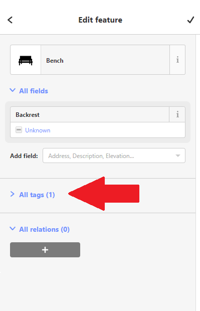
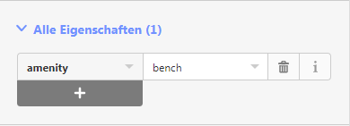

= Lehrpersonen-Informationen zum Arbeitsblatt "OpenStreetMap bearbeiten"
OpenSchoolMaps.ch -- Freie Lernmaterialien zu freien Geodaten und Karten.
//
// HACK: suppress title page.
// See https://github.com/asciidoctor/asciidoctor-pdf/issues/95
ifdef::backend-pdf[:notitle:]
:lang: de
:figure-caption: Abbildung

ifdef::backend-pdf[]
[discrete]
= {doctitle}

{author}
endif::[]
// END OF suppress title page HACK

mit Hilfe des iD-Editors ein Bänkli, einen Brunnen oder einen Abfallkübel eintragen

*Ein Arbeitsblatt für Lehrpersonen*

Auf OpenStreetMap können Sie nicht nur die Weltkarte anschauen, sondern diese auch editieren. Um Daten zu ergänzen oder abzuändern, brauchen Sie zuerst ein Benutzerkonto.

== Zeitplanung

Für die einzelnen Aufgaben sind etwa folgende Zeit benötigt:

* Registrierung: 5 Minuten
* Rundgang für den Editor: 20–30 Minuten
* Selber auf OpenStreetMap Daten eintragen: 20–30 Minuten

Das Arbeitsblatt sollte etwa eine Lektion (45 Minuten) dauern.

== Vorbereitung

Für diese Aufgabe ist ein OSM-Konto benötigt

== Benutzerkonto erstellen und anmelden
  
Um ein Benutzerkonto zu erstellen drücken Sie auf die Schaltfläche "Registrieren" oben rechts. Dazu müssen Sie Ihre Email-Adresse angeben und sich einen Benutzernamen und ein Passwort aussuchen. Falls Sie bereits ein OpenStreetMap-Benutzerkonto haben, können Sie stattdessen natürlich direkt auf "Anmelden" klicken.

Nachdem Sie die Registrierung abgeschlossen haben, schickt Ihnen OpenStreetMap eine Email und die Adresse, die Sie angegeben haben, um zu prüfen, ob Sie wirklich über diese Email-Adresse erreichbar sind. In dieser Nachricht werden Sie einen Bestätigungs-Link finden, den Sie besuchen müssen, um die Registrierung zu vervollständigen.

NOTE: Alternativ kann man sich auch mit einem Google-, Facebook- oder Microsoft-Konto einloggen.

== Sprache umstellen (falls nötig)

Wenn die Knöpfe auf openstreetmap.org nach der Anmeldung nicht in deutscher Sprache angezeigt werden, können Sie das folgendermassen ändern:

1. Klicken Sie oben rechts auf den Knopf mit Ihrem Benutzernamen
2. Wählen Sie im Dropdown-Menü "Settings" aus
3. Unter der Einstellung "Preferred Languages" ersetzen Sie den Text mit `de-CH de`
4. Klicken Sie den "Save Changes"-Knopf ganz unten, um diese Änderung zu speichern

Der im Folgenden verwendete Editor wird die selbe Sprache verwenden, falls verfügbar.

== iD, der Web-Editor von OpenStreetMap

Es gibt verschiedene Editoren, mit denen OpenStreetMap bearbeitet werden kann. Wir werden den Editor namens "iD" verwenden, der auf der openstreetmap.org-Website bereits eingebaut ist.

=== Rundgang

Um diesen Editor kennenzulernen, sollten Sie zuerst dessen eingebauten "Rundgang" durcharbeiten. Dazu drücken Sie auf den "Bearbeiten"-Knopf oben links. Falls Ihnen danach eine Willkommens-Nachricht angezeigt wird, drücken Sie auf "Rundgang starten". Andernfalls drücken Sie auf das Fragezeichen-Symbol (auf der rechten Seite) und starten von dort aus den Rundgang.

IMPORTANT: Bitte spielen Sie den Rundgang einmal durch, bevor Sie OpenSchoolMap Ihren Schülern vorstellen.

.Mögliche Fragen, die aufkommen können:
[NOTE]
====

* *Wie vervollständigt man eine Fläche?*
Eine Fläche wird erstellt, sobald mal den Umriss beendet hat, indem man wieder den ersten Punkt anklickt oder Enter drückt.

* *Der Kreis um den Tank ist zu gross!*
Die viereckige Fläche, die für den Kreis verwendet wird, muss im Tank drin sein und mit den Ecken den Rand berühren.

Ansonsten sollte das Tutorial selbsterklärend sein.
====

=== Und los geht's!

Alle Änderungen, die Sie während des "Rundgangs" gemacht haben, waren nur zur Übung und wurden nicht wirklich in OpenStreetMap eingetragen.

Fehlt auf der OpenStreetMap-Karte etwas, oder ist etwas gar falsch? Vielleicht fällt Ihnen an Ihrem Wohnort oder in der Gegend Ihres Schulhauses etwas auf, das verbessert oder ergänzt werden kann. Gibt es z.B. ein Bänkli, einen Brunnen oder einen Abfalleimer, der noch fehlt?

Da Sie im Rundgang gelernt haben, wie Sie Dinge in OpenStreetMap eintragen und ändern können, können Sie nun Fehlendes eintragen und Falsches korrigieren!
Innerhalb von 5–30 Minuten werden Ihre Änderungen durchgeführt und auf die Karte angewendet!

[NOTE]
====
OpenStreetMap speichert Objekt-Eigenschaften in Form von so genannten Tags.
Diese sehen Sie auf der linken Seite im iD-Editor, nachdem Sie ein Objekt angewählt haben.

.{zwsp}

Wenn Sie das Feld "Alle Eigenschaften" aufklappen, sehen Sie alle Tags des Objekts.

.{zwsp}

Wenn Sie nicht wissen, welchen Tag Sie verwenden sollen, können Sie im Cheatsheet nachschauen.
====

Falls Ihnen selbst nichts aufgefallen ist, was geändert oder ergänzt werden müsste, klicken Sie auf das "OpenStreetMap"-Logo oben links, um den iD-Editor zu verlassen und zur Karte zurückzukehren. Klicken Sie dann auf den "Ebenen"-Knopf (der mit den gestapelten Flächen  als Icon) und wählen Sie die Checkbox "Hinweise/Fehlermeldungen" an. Schauen Sie, ob Sie Notizen anderer Kartenbenutzer sehen, die auf Fehler oder Auslassungen hinweisen, die Sie durch Änderungen beheben können. Wenn Sie etwas gefunden haben, klicken Sie wieder auf "Bearbeiten".

include::../../../snippets/kontaktinformationen.adoc[]

https://www.openschoolmaps.org

Frei verwendbar unter CC0 1.0 image:../../../bilder/license.png[Lizenz, 66, 23]: http://creativecommons.org/publicdomain/zero/1.0/