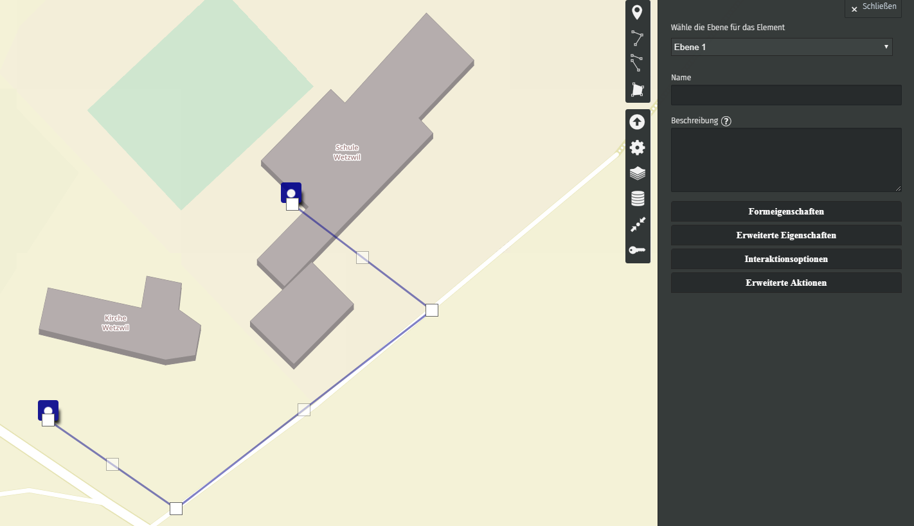

= Mit uMap einen Lageplan erstellen (mithilfe von OpenStreetMap)
OpenSchoolMaps.ch -- Freie Lernmaterialien zu freien Geodaten und Karten.
//
// HACK: suppress title page.
// See https://github.com/asciidoctor/asciidoctor-pdf/issues/95
ifdef::backend-pdf[:notitle:]

ifdef::backend-pdf[]
[discrete]
= {doctitle}

{author}
endif::[]
// END OF suppress title page HACK

am Beispiel eines Anlasses beim Schulhaus

*Eine Anleitung für Lehrpersonen*

== Ziel dieser Anleitung
Das Ziel dieser Anleitung ist es, dass Lehrpersonen wie Sie fähig sind, mit uMap eine Karte zu erstellen, die sich zum Beispiel als Lageplan verwenden lässt.

.Kartendaten (C) OpenStreetMap Contributors
[caption=""]
image::../../bilder/umap/lageplan_erstellen/lageplan_endprodukt.png[]

Die volle Beispielkarte sehen Sie unter https://umap.osm.ch/de/map/sportevent-grundschule-wetzwil_1355#20/47.29694/8.62575. Eventuell müssen Sie noch auf die blauen Stecknadeln reinzoomen.

Sie werden für das Beispiel etwa 10-15 Minuten brauchen.

Die Internationale Version von uMap gibt es unter https://umap.openstreetmap.fr/de/, aber wir empfehlen, dass Sie die Schweizer Version verwenden, wenn sich Ihre Karte in der Schweiz befindet.

== Was ist uMap?
Mit uMap kann man auf OpenStreetMap Hintergrund eine eigene Karte zeichnen. Alle Zeichnungen und Objekte sind nur auf der Karte, die Sie erstellt haben, zu sehen. Wenn Sie fehlende Gebäude oder Strassen auf der Karte finden, können Sie sich auf openstreetmap.org anmelden und dort jeweils die fehlenden Objekte hinzufügen. Eine Anleitung für den Online Editor von OpenStreetMap finden Sie unter https://gitlab.com/OpenSchoolMaps/OpenSchoolMaps.ch/-/jobs/artifacts/master/raw/lehrmittel/umap/lageplan_erstellen.pdf?job=PDFs.

== Anleitung für uMap

Als Beispiel wird ein Sportevent einer Schule verwendet.

1. Besuchen Sie https://umap.osm.ch
2. Wählen Sie "Erstelle eine Karte"
3. Navigieren Sie zu dem Ort, wo sie eine Karte erstellen möchten, zum Beispiel Ihre Schule.
4. Wenn Sie einen Punkt erstellen wollen, hier zum Beispiel den Empfang, klicken Sie oben rechts in der Map auf das Stecknadel-Icon image:../../bilder/umap/stecknadel_icon.PNG["Stecknadel-Icon", 25, 25]. Diesen können Sie dann auf der Map platzieren.

+
.Kartendaten (C) OpenStreetMap Contributors
[caption=""]

5. Eine weitere Möglichkeit ist, einen Weg image:../../bilder/umap/weg_icon.PNG["Weg-Icon", 25, 25] einzuzeichnen, zum Beispiel um anzuzeigen, wie Besucher von der Bushaltestelle zum Event gelangen, so wie wir das hier getan haben.

+
.Kartendaten (C) OpenStreetMap Contributors
[caption=""]

6. Für Flächen, klicken sie auf das Flächensymbol image:../../bilder/umap/flaeche_icon.PNG["Flächen-Icon", 25, 25]. Wir haben hier den Sportplatz eingezeichnet.

+
.Kartendaten (C) OpenStreetMap Contributors
[caption=""]

Wenn Sie mit Ihrem Lageplan zufrieden sind, können Sie auf die Schaltfläche "Speichern" oben rechts klicken. Danach können Sie noch den Editiermodus verlassen, indem Sie auf den Schriftzug "Bearbeiten deaktivieren", auch oben rechts, klicken.
Sie haben nun erfolgreich Ihren ersten Lageplan mit uMap erstellt!

uMap und das OpenSchoolMaps Projekt basieren auf OpenStreetMap (https://osm.org).

//(Siehe auch Abschnitt [Erstellen eines Lageplanes mit uMap](https://dinacon.ch/wp-content/uploads/sites/4/2017/10/dinacon_17.pdf#Outline0.2) im Foliensatz des DINAcon-Vortrags [Nutzung von OpenStreetMap für Standortkarten und Online-Stories](https://dinacon.ch/sessions/2017/osm/).)

include::../../../snippets/kontaktinformationen.adoc[]
