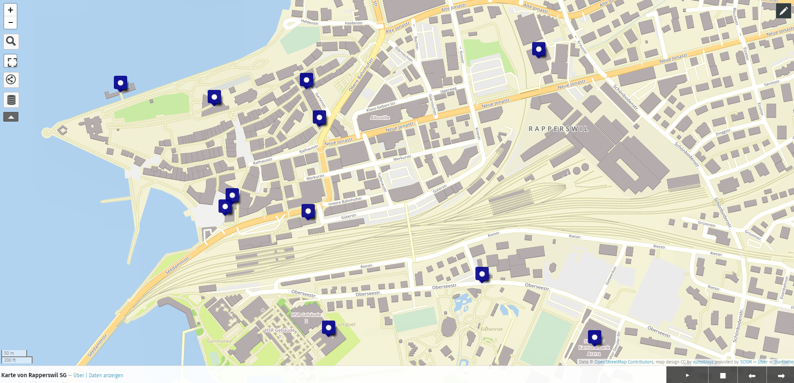
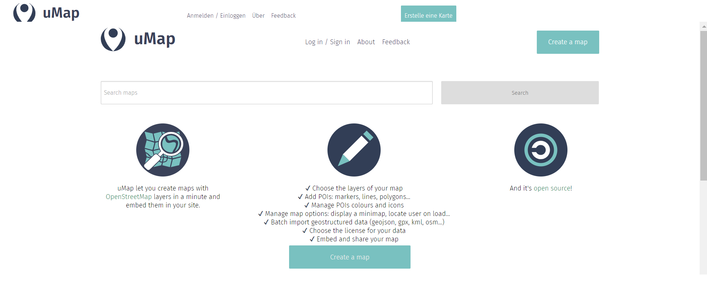
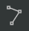
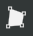
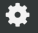
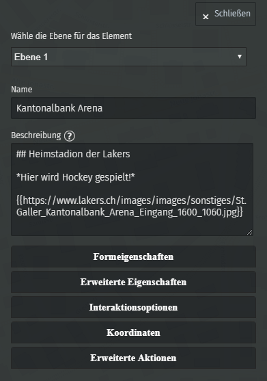
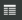
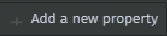
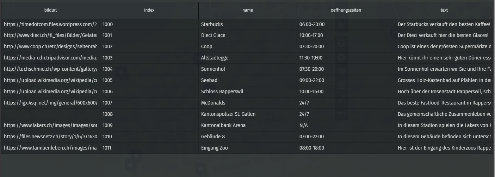

= Mit uMap eine Story-Map mit Bildern erstellen
OpenSchoolMaps.ch -- Freie Lernmaterialien zu freien Geodaten und Karten.
//
// HACK: suppress title page.
// See https://github.com/asciidoctor/asciidoctor-pdf/issues/95
ifdef::backend-pdf[:notitle:]
:lang: de
:figure-caption: Abbildung

ifdef::backend-pdf[]
[discrete]
= {doctitle}

{author}
endif::[]
// END OF suppress title page HACK

*Eine Anleitung für alle an Mapping-Interessierten*

//(Siehe auch Abschnitt https://dinacon.ch/wp-content/uploads/sites/4/2017/10/dinacon_17.pdf#Outline0.3[Erstellen einer Fotostory mit uMap] im Foliensatz des DINAcon-Vortrags https://dinacon.ch/sessions/2017/osm/[Nutzung von OpenStreetMap für Standortkarten und Online-Stories].)

Das Ziel dieser Anleitung ist es, mit uMap im Rahmen des OpenSchoolMaps-Projekts eine Story-Map zu erstellen. In der Geographie ermöglicht eine Story-Map eine ansprechende und informative Kombination aus öffentlich verfügbaren Karten, begleitendem Text, Bildern und Multimedia-Inhalten.
So sieht die Karte aus, die wir erstellen werden:

.Kartendaten (C) OpenStreetMap Contributors

Die volle Beispielkarte sehen Sie unter https://umap.osm.ch/de/map/karte-von-rapperswil-sg_1377#15/47.2188/8.8119. Eventuell müssen Sie noch auf die blauen Stecknadeln reinzoomen.

== Vorbereitung
Zuerst brauchen Sie einen Web-Browser in dem Sie die Seite öffnen können. 
Überlegen Sie sich im Vorfeld, wie das Endprodukt in etwa aussehen soll und notieren Sie sich, welche Punkte Sie darin haben wollen. Dieser Schritt ist natürlich optional, aber sehr nützlich, um später schneller voranzukommen.

== Erstellen der Story-Map

  * Besuchen Sie die Seite umap.osm.ch.
  * Erstellen Sie eine neue Karte. +
+
.{zwsp}

  * Tragen Sie Punkte  ein, die Sie gerne auf der Map hätten. Sie können auch Linien  und Flächen  auf die Karte eintragen, wenn Sie möchten.
* Nun zur eigentlichen "Story". Der wichtigste Schritt ist das Aktivieren der Diashow unter "Einstellungen  -> Diashow -> Diashowmodus aktivieren". Nach dem Speichern der Einstellungen müssen Sie wahrscheinlich mit F5 erneuern.

== Beschreibung hinzufügen

Da Sie nun verschiedene Punkte der Karte hinzugefügt haben, können wir jetzt jeden Punkt noch mit einer Beschreibung ergänzen. Diese Beschreibungen werden während der Diashow dargestellt.

Um eine Beschreibung hinzuzufügen, klicken Sie (im Editiermodus) auf den Punkt, den Sie editieren möchten und schreiben Sie Ihren Text in die Box "Beschreibung".
Schreiben Sie zusätzlich in die Textbox "Name" noch einen geeigneten Namen für den Punkt, da wir diesen später brauchen werden.

[NOTE]
====
Um eine schöne Beschreibung zu erstellen haben wir für Sie einige Tipps:

* Um eine kursive Schrift zu machen, brauchen Sie `+*Ein Stern*+`.
* Um eine fette Schrift zu machen, brauchen Sie `+**Zwei Sterne**+`.
* Um Überschriften zu machen brauchen Sie `# Titel`. Je mehr `#` desto kleiner die Überschrift.
	
Weitere Darstellungsarten finden Sie, wenn Sie auf das Fragezeichen über der Textbox von "Beschreibung" klicken.
====

Um ein Bild in die Beschreibung hinzuzufügen, brauchen Sie zuerst den Link zum Bild.
Wenn der Link `https://www.example.com/picture.png` ist, dann müssen Sie folgenden Text eingeben: `{{https://www.example.com/picture.png}}`

Ihre Beschreibung sollte nun etwa so aussehen:

.{zwsp}

Fügen Sie nun jedem Punkt eine Beschreibung hinzu. Wenn Sie zufrieden sind mit dem Ergebnis, können Sie auf die Schaltfläche "Speichern" oben rechts klicken und den Editiermodus verlassen.

Durch einen Klick auf die Play-Schaltfläche können Sie die Diashow starten und ihre Storymap anschauen.
Wenn Sie auf die Stopp-Schaltfläche klicken, können Sie die Diashow beenden.

== Darstellung ändern (Optional)

* Sie können das Aussehen von Pins unter "Einstellungen -> Standard-Formeigenschaften -> Bildzeichenform" ändern.
* Sie können die Informationen des Popups auch in der Seitenleiste anzeigen lassen. Dazu gehen Sie unter "Einstellungen -> Standard-Interaktionsoptionen -> Popupstil" und wählen "Seitenleiste" aus. Nach dem Speichern und Erneuern der Website, sollten die Popup-Informationen in der Seitenleiste angezeigt werden.

== Reihenfolge der Diashow steuern (Für Fortgeschrittene)

Um die Reihenfolge der Orte in der Diashow zu steuern, müssen wir diesen einen Sortierschlüssel hinzufügen. Öffnen Sie dazu die Ebenenverwaltung  und klicken Sie auf das winzige Symbol "Merkmale in einer Tabelle bearbeiten" . Klicken Sie dort auf die Schaltfläche  und geben Sie einen Namen (zum Beispiel "index") ein. Nun können Sie für jeden Ort einen Wert in der Spalte "index" eingeben mit dem die Website die Reihenfolge sortieren kann. Da die Tabelle in uMap lexiographisch sortiert, wird zum Beispiel die Nummer 20 vor der Nummer 3 vorkommen. Um das zu verhindern sollten Sie zum Beispiel Werte wie 1000 und aufwärts verwenden um zu sortieren. Wenn Sie für jede Ortschaft einen Sortierschlüssel hinzugefügt haben, müssen Sie dann unter Einstellungen -> Standardeigenschaften -> Sortierschlüssel die neu erstellte Sortierschlüssel-Spalte auswählen. (Hier wird Ihnen keine Auswahl gestellt - Sie müssen den Namen des Feldes selber eintragen!)

== Merkmale hinzufügen (Für Fortgeschrittene)

Bisher haben wir die ganze Beschreibung immer selbst geschrieben. Um uns diesen Vorgang zu vereinfachen, können wir diese Informationen mit Merkmalen speichern.

Wie Sie im vorherigen Schritt "Reihenfolge der Diashow steuern" gelernt haben, müssen Sie hier auch neue Merkmale der Tabelle hinzufügen.
Zwei weitere Spalten, die Sie sicherlich brauchen, sind "bildurl" und "text". Wir haben im Beispiel noch eine weitere Spalte "oeffnungszeiten" hinzugefügt. Diese ist jedoch optional und natürlich können Sie auch andere Spalten hinzufügen, wenn Sie möchten.

Füllen Sie die neu erstellten Spalten mit Werten und schliessen Sie die Seitenleiste wieder. Das Ergebnis sollte etwa so aussehen:

.{zwsp}

Um diese Werte nun aus der Tabelle auch zu brauchen, müssen Sie unter "Einstellungen -> Standard-Interaktionsoptionen -> Popup Vorlage" diesen Text einfügen:

....
{text}
{{{bildurl}}}
{oeffnungszeiten}
....

NOTE: Wenn Sie keine Spalte "oeffungszeiten" haben oder generell andere Spaltennamen genutzt haben, müssen Sie diese entsprechend abändern oder entfernen.

Von nun an müssen Sie für die neuen Punkte auf der Karte nur noch die Informationen in der Tabelle ergänzen und danach wird der Anzeigetext für das Popup automatisch zusammengestellt.

IMPORTANT: Beim Erstellen einer uMap werden die Daten in OpenStreetMap nicht verändert, sondern nur "darauf gezeichnet".

uMap und das OpenSchoolMaps Projekt basieren auf OpenStreetMap (https://osm.org).

include::../../snippets/kontaktinformationen.adoc[]

https://www.openschoolmaps.org

image:../../../bilder/license.png[Lizenz, 66, 23] Frei verwendbar unter CC0 1.0: http://creativecommons.org/publicdomain/zero/1.0/